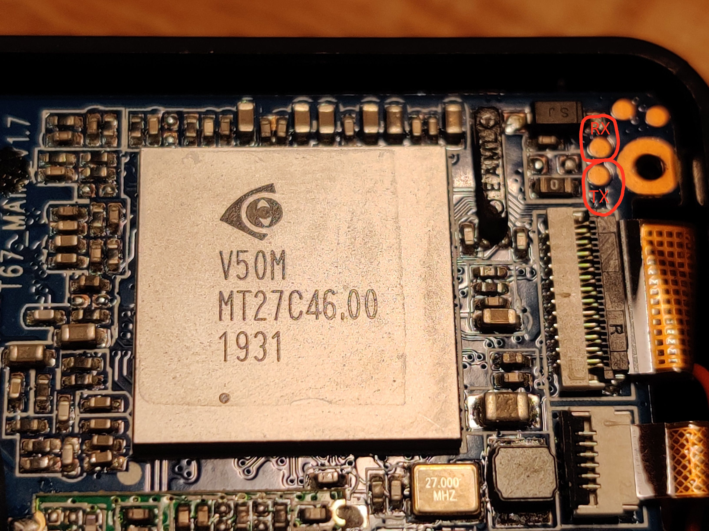

Some pictures taken of the inside of my Akaso V50 Pro SE.

UART interface is at the top right of this image.

For wifi/bluetooth the device uses some realtek module. Couldn't read which chip exactly.

[Pretty sure this is used for the RF remote](https://commons.wikimedia.org/wiki/File:Revell_Control_Helicopter_Glowee_2.0_-_controller_-_XN297LBW-7369.jpg)
Update: Yes, the XN297LBW is a RF chip in the range of 2.400~2.483GHz. [source](https://datasheet.lcsc.com/szlcsc/Panchip-Microele-XN297L_C88025.pdf)

A Winbond flash chip. Will dump the contents sometime soon.
